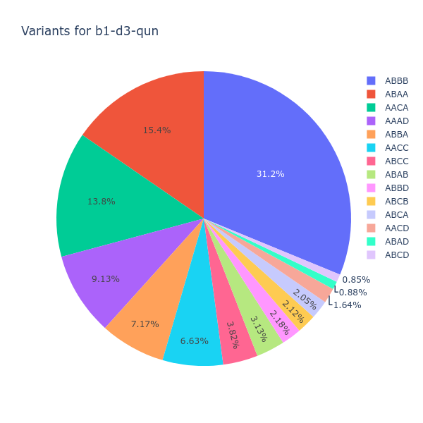

# witrels

A Python script which compares TEI-XML diplomatic transcriptions 
created according to the [SCTA standards](http://community.scta.info/pages/lombardpress-schema-diplomatic.html).

🄯 2021 [Nicolas Vaughan](http://nicolasvaughan.org)

n.vaughan@uniandes.edu.co

Universidad de los Andes, Colombia

## Requirements

- Python 3.8+
- collatex~=2.2
- beautifulsoup4~=4.9.0
- lxml>=4.6.0
- tqdm>=4.60.0
- pandas>=1.2.0
- requests>=2.25.0
- levenshtein>=0.12.0
- plotly>=4.14.0
- kaleido>=0.2.0

[Plotly](https://plotly.com/python/) and [Kaleido](https://github.com/plotly/Kaleido)
are optional, as they are required only to produce a pie chart 
and render it on a web browser.

## Installation
1. Clone this repo: `git clone https://github.com/nivaca/witrels` 
2. `cd witrels`   
2. `pip install -r requirements.txt `

 
## How Does It Work
In the [data.lst](https://github.com/nivaca/witrels/blob/main/data.lst) file a list of URLs of TEI-XML files is included.
For instance:

```
https://raw.githubusercontent.com/scta-texts/wodehamordinatio/master/b1-d1-q13/maz_b1-d1-q13.xml
https://raw.githubusercontent.com/scta-texts/wodehamordinatio/master/b1-d1-q13/sorb193_b1-d1-q13.xml
https://raw.githubusercontent.com/scta-texts/wodehamordinatio/master/b1-d1-q13/tara_b1-d1-q13.xml
https://raw.githubusercontent.com/scta-texts/wodehamordinatio/master/b1-d1-q13/vatlat955_b1-d1-q13.xml
```

These files must all be valid witnesses of a same document. 
Ideally, they must have been created following the the [SCTA standards](http://community.scta.info/pages/lombardpress-schema-diplomatic.html) for diplomatic editions, 
although other TEI-p5-compliant files might be correcly processed. 
It is required, however, that all documents be structurally identical.
Such an isomorphism is ensured by using the same number of textual paragraphs (`//text//p`)
with the same `@xml:id`.
   
For instance, witness 1 (`#V`) can have:

```xml
<p xml:id="b1d3qun-cdtvet">
    <lb ed="#V" n="12"/>Circa distinctionem tertiam quaero utrum mens humana sit  imago trinitatis increatae sicut in rebus aliis factis propter hominem
    <lb ed="#V" n="13"/>est vestigium eiusdem trinitatis
</p>
```

while witness 2 (`#T`) has:

```xml
<p xml:id="b1d3qun-cdtvet">
    <note type="marginal-note" place="margin-left">distinctio tertia</note>
    <lb ed="#T" n="42"/><hi rend="ii-3">C</hi>irca distinctionem tertiam quaero utrum mens humana sit ymago trinitatis increatae sicut
    <lb ed="#T" n="43"/>in rebus aliis factis propter hominem est vestigium eiusdem trinitatis
</p>
```

All elements are stripped off for comparison: `<note>`, `<lb/`, and so on. (See [xmlcleaners.py](https://github.com/nivaca/witrels/blob/main/xmlcleaners.py) for details.)

A [Python port](https://interedition.github.io/collatex/pythonport.html) 
of the [CollateX](https://collatex.net/) tool set is used to compare each `<p>` across all witnesses. 
Collatex breaks down the text into several sections and then produces a json output.
Witrels then parses and analises this output, and then performs very simple statistical analysis
in order to reveal similarity relationships between the witnesses.

A typical output can be:

```
ABBB: 31.21%
ABAA: 15.41%
AACA: 13.77%
AAAD: 9.13%
ABBA: 7.17%
AACC: 6.63%
ABCC: 3.82%
ABAB: 3.13%
ABBD: 2.18%
ABCB: 2.12%
ABCA: 2.05%
AACD: 1.64%
ABAD: 0.88%
ABCD: 0.85%
```

with the corresponding pie chart being:

